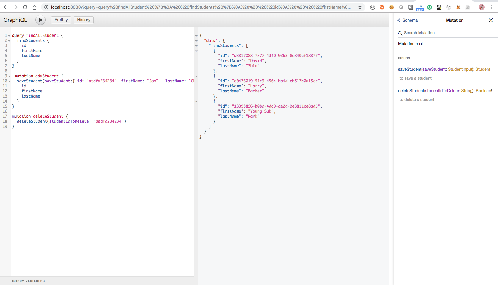

Student Service (GraphQL demo)
==============================
Student Service is a demo project built using Springboot Framework and SPQR.


To run the project:
```
gradle bootRun
```

Go to `http://localhost:8080` to render the graphiQL page.



To execute request via curl:

```
curl --request POST \
--url http://localhost:8080/graphql \
--header 'content-type:application/json' \
--data '{ "query": "query getAllStudents { students { firstName lastName id}}", "operationName": "getAllStudents" }' 
```